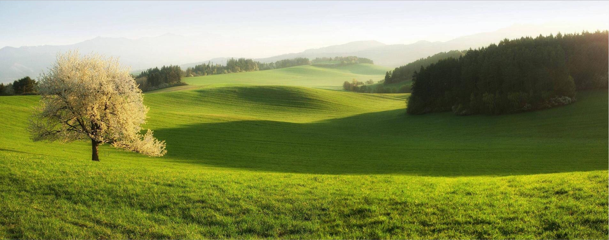
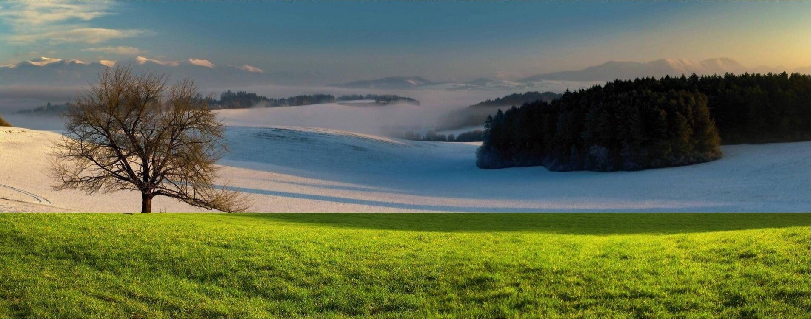
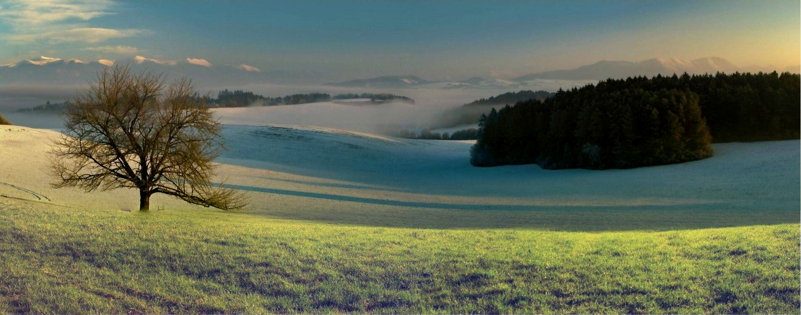

# ___Pietro Parini 794146___
# ___Visual Information Processing and Management___
# ___Assignment 1: Blend piramidale___

******

    """  
        Created on Tue Nov 12 10:38:36 2019  
        @author: pietro  
        @version: python3  
        @library: opencv  
        @library : numpy  
        1- caricare 2 immagini e la maschera  
        2- calcolare le piramide gaussiane per le due immagine e per la maschera  
          @function: gaussian_pyramid  
        3- partendo dalla piramide gaussiana calcolare la piramide laplaciana  
          @function: laplacian_pyramid  
        4- mescolare ogni livello della piramide secondo l'immagine della maschera con
        corrispondente livello della piramide gaussiana  
          @function: blendLaplacesAndMask  
        5- ricostruire l'immagine originale partendo dalla laplaciana mescolata
          espandendo il livello e aggiungendolo al livello inferiore  
          @function: recosrtuct  
    """

